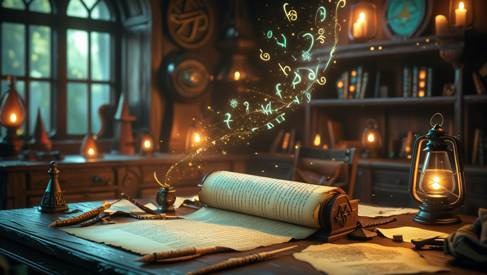

# 🌙📜 FableScrolls - A Fantasy-Themed Encyclopedia App

**FableScrolls** is a beautifully crafted fantasy-themed encyclopedia Android application designed to guide users through a vast collection of categorized knowledge—ranging from ancient myths to world history. Whether you're a curious mind or a seeker of forgotten lore, FableScrolls opens the gateway to explore and learn in a magical environment.

---



---

## 🗬 Features

* 📚 **Category-Based Knowledge**

  * Bangla-language content organized under categories like:

    * প্রাচীন ইতিহাস (Ancient History)
    * বাংলার ইতিহাস (History of Bengal)
    * বিশ্ব ইতিহাস (World History)
    * কৃষি, প্রাণী, বিজ্ঞান, ভুগোল ইত্যাদি

* 🍗 **Fantasy-Themed UI**

  * Scroll animations, magical colors, and immersive design for a mystical reading experience.

* 🌤️ **Offline Access**

  * Browse most of the content without needing an internet connection.

* 🌐 **Bangla Language Support**

  * All information is available in native Bangla for better accessibility and cultural depth.

---

## 🔧 Tech Stack

* 🧱 **Android Studio (Java)**
* 🎨 **Custom XML Layouts**
* 🧙‍♂️ Fantasy Fonts, Icons, and Animations

---

## 🚀 Installation

1. Clone the repository:

   ```bash
   git clone https://github.com/khrizve/FableScrolls-Encyclopedia_App.git
   ```
2. Open in **Android Studio**
3. Build and run on an emulator or Android device

---

## 🌿 Future Features

* 📖 Bookmark & Search Functionality
* 🌑 Dark Mode Support
* 📅 Content Updates via Online Sync
* 🔮 Voice Narration of Articles
* 📜 PDF Export of Scrolls

---

## 👩‍🎄 Contribution

Contributions are welcome! If you have ideas for categories, articles, or UI improvements, feel free to fork the project and open a pull request.

---

## 📜 Lore Behind FableScrolls

> "In a realm where knowledge is magic and scrolls hold the stories of civilization, *FableScrolls* serves as the last archive of wisdom—hidden in plain sight, waiting for the worthy."

—

**Crafted with enchantment by Rizve** ✨
🔮 *Let the scrolls guide your journey.*
